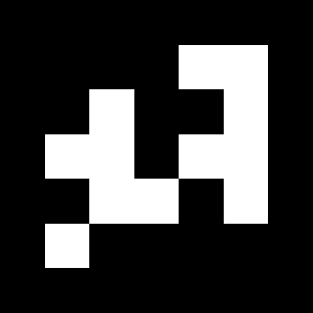

## Camera localization

This is the third exercise from vision for robotics about creating a program that tracks a camera with markers.

First we calibrate the camera using OpenCV with a 9x6 Chessboard

### Code will be uploaded soon!